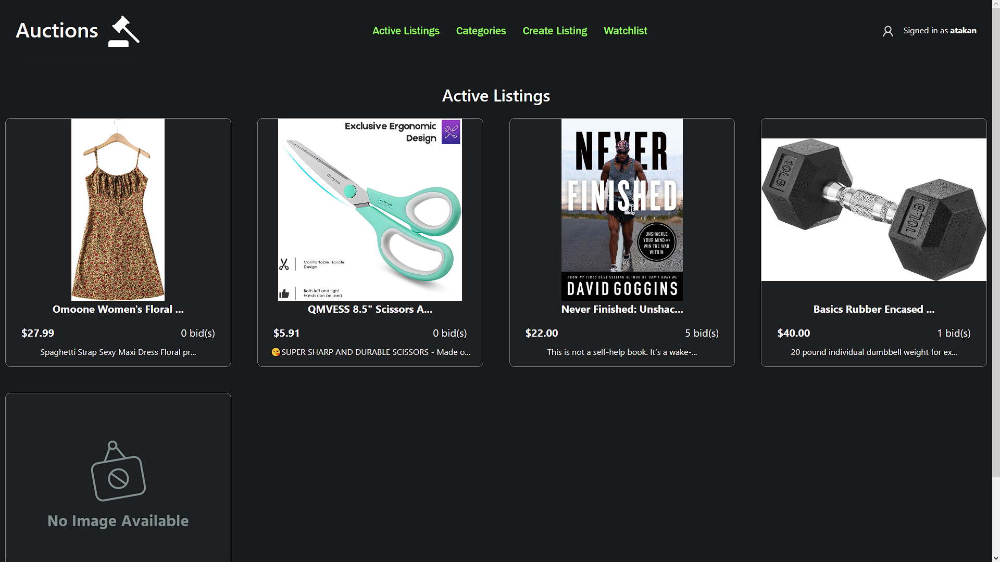

# eBay-like E-Commerce Auction Site

An eBay-inspired e-commerce auction site was developed to enhance my skills in web development. Dive in to see how users can engage in auctions, add their favorite items to a watchlist, comment, and more! This project was built as Project 2 for HarvardX's 'CS50’s Web Programming with Python and JavaScript' course.



## Table of Contents

- [Technologies Used](#technologies-used)
- [Features](#features)
- [Installation and Usage](#installation-and-usage)

## Technologies Used

- Python
- Django
- HTML
- CSS

## Features

- **Auction Listings**: Users can post auction listings with titles, descriptions, starting bids, images, and categories.
- **Bidding**: Allows users to place bids, ensuring the latest bid always surpasses the previous one.
- **Comments**: Users can discuss listings through comments.
- **Watchlist**: Personalized watchlist for users to track their favorite auctions.
- **Categories**: Allows filtering of listings by predefined categories.
- **Admin Interface**: A robust admin interface to manage listings, comments, and bids.


## Installation and Usage

```bash
# Clone the repository
git clone https://github.com/mapleleafu/auction-site-django

# Navigate to the directory
cd path_to_directory

# If you don't have Python and Django, install them
# Set up a virtual environment (optional but recommended)
python3 -m venv venv_name

# Activate the virtual environment
source venv_name/bin/activate  # On Windows, use `venv_name\Scripts\activate`

# Run database migrations
python manage.py migrate

# Start the Django development server
python manage.py runserver
